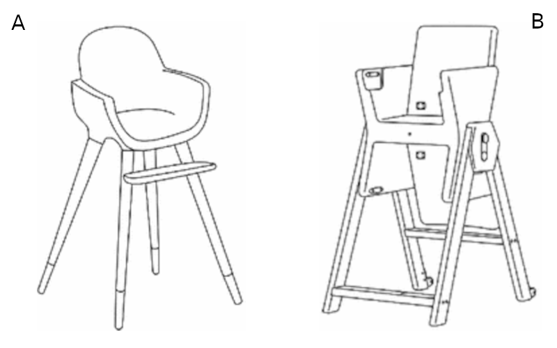
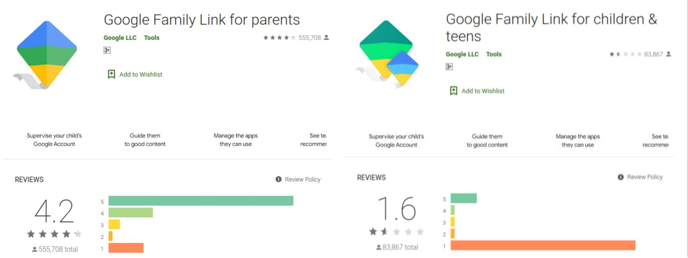

تابستان قبل از کرونا به همراه خانواده برای شام به یک کبابی رفتیم.
سفارش دادیم و منتظر نشسته بودیم که دو خانواده که یکی از آنها دختر بچه‌ای حدوداً ۳ ساله داشت وارد مغازه شدند و در میز کناری ما نشستند.

کودک از همان ابتدای نشستن بر روی صندلی شروع کرد به غر زدن که : _«صندلی **من** را بیاوردید»_ (همین قدر رسمی!).
مادرِ کودک از متصدی کبابی خواهش کرد تا صندلی مخصوص کودکان را برای کودکش بیاورند ولی کودک بی‌صبرانه جمله را تکرار می‌کرد: _«صندلی **من** را بیاوردید»_.
مادرِ کودک که کلافه شده بود گفت:
«نمی‌دونم چرا هر دفعه که به این کبابی می‌آیم اینقدر به صندلی گیر می‌ده! جالبه که توی خونه اصلاً روی صندلی کودک خودش نمی‌شینه!»

متصدی رستوران صندلی مخصوص کودک رستوران را آورد و کنار میز قرار داد.
مادر کودک را بلند کرد و در صندلی قرار داد.
غر زدن‌های کودک جای خود را به شادی داد و بلافاصله با خوشحالی گفت: «پایم می‌رسه!»

جمله‌ی کودک برای من بسیار شکه کننده بود.
اگر کودک نیازش را زبان نمی‌آورد، احتمال اینکه تشخصی دهیم که علت تفاوت برخورد کودک نسبت به دو صندلی، وجود جایی برای قرار دادن پا در صندلی کبابی (صندلی A) و احتمالاً فقدان آن در صندلی خانه (صندلی B) است، بسیار کم بود. [^1]

## وقتی خریدار، مصرف‌کننده نیست

در کتاب «دیزاین بریف: تفهیم‌نامه طراحی» (چکیده و نظر من در مورد این کتاب را می‌توانید در [این پست از کتابخانه‌ام](https://www.asaiyan.com/fa/library/design-brief) مطالعه کنید) یکی از مهمترین چالش‌های طراحان را نداشتن زبان مشترک با مشتری عنوان کرده است و مقصر را طراحانی می‌داند که برای توصیف و ارائه محصول خود، بجای تمرکز بر ارزش‌های تجاری بر ویژگی‌های زیبایی‌شناسی و هنری تمرکز می‌کنند.
برای رفع این مشکل در آن کتاب فرایندی را برای طراحی ییشنهاد می‌کند تا مشکلات ناشی از این چالش به حداقل برسد.

اما در مورد طراحی محصولات برای کودکان علاوه بر مشکلی که مطرح شد، مشکل اساسی‌تری نیز وجود دارد و آن اینکه خریدار (سرپرست کودک) با معیارهای خود محصولی را می‌خرد که قرار است فرد دیگری از آن استفاده کند.
در خاطره‌ی بخش قبل، صندلی را پدر و مادر برای دخترشان خریده‌اند ولی احتمالاً مهمترین ویژگی از دید کودک توجه نکرده بودند.

البته قطعاً صندلی B هم ویژگی‌های قابل توجهی از دید والدین بچه داشت که آن را خریده‌بودند.
(محکم بودن، قابلیت تنظیم اندازه برای سنین مختلف، رنگ زیبا، برند و ...)
شاید سوال مهمتر این باشد که اگر کودک نیازش را زودتر بیان می‌کرد و والدین حق انتخاب داشتند، از معیارهایشان دست می‌کشیدند و صندلی A را می‌خریدند؟

## وقتی داستان به یک صندلی ختم نمی‌شود

اگر تا اینجای مطلب را خوانده باشید، احتمالاً سازنده‌ی صندلی B را سرزنش کرده‌اید که چرا به نیازهای کودکان توجه نکرده است.
اما مسئله وقتی جدی‌تر می‌شود که متوجه شویم بازیگران بزرگتری نسبت به سازندگان صندلی کودک با چالش طراحی محصول برای کودکان و والدین مواجه هستند.

اگر بچه داشته باشید و دغدغه‌ی مراقبت از کودک خود در فضای مجازی را داشته باشید و یا صفحه‌ی شخصی وزیر ارتباطات در اینستاگرام را دنبال کرده باشید، احتمالاً اسم سرویس [Google Family Link](https://families.google.com/familylink/) را شنیده‌اید. این سرویس گوگل یک ابزار Parental Control است که به والدین امکان می‌دهد بر استفاده‌ی کودکانشان از گوشی یا تبلت اندرویدی که در اختیار دارند نظارت کنند.

در تصویر زیر مقایسه‌ای از وضعیت نصب و امتیاز دو برنامه‌‌ی این سرویس را در Google Play مشاهده می‌کنید.
تصویر سمت چپ برنامه‌ای است که والدین بر روی گوشی خود نصب می‌کنند[^2] و تصویر سمت راست برنامه‌ای است که بر روی گوشی یا تبلت کودکان و نوجوانان نصب می‌شود[^3]. به توزیع امتیازهای کاربران در برنامه توجه کنید!

در این سرویس والدین بسیار راضی هستند و کودکان بسیار ناراضی.
بخشی از این تفاوت امتیازدهی می‌تواند به دلیل تضاد خواسته‌های والدین و کودکان باشد(کودکان دوست ندارند محدود شوند)، اما برخی از شکایت‌ها قابل رفع است.
به عنوان مثال بیشترین شکایت کودکان از مصرف باتری این سرویس است.
آیا این مورد قابل بهینه سازی نیست؟ شاید اولویت نیست! (خریداران راضی هستند، پس چنین بهینه‌سازی‌هایی به راحتی در اولویت قرار نمی‌گیرند)

## بزرگترین چالش چه زمانی رخ می‌دهد؟

چالش اصلی زمانی پیش می‌آید که معیارها و خواسته‌های کودکان و والدین در تعارض قرار می‌گیرند.
در مثال صندلی اگر معیار اصلی والدین این باشد که صندلی بخرند که ایمن باشد و برای چند سال قابل استفاده باشد، احتمالاً مستقل از نظر کودک، صندلی B مناسب است و از نظر فروش و تجاری صندلی B ممکن است موفقتر باشد.
ولی این موفقیت می‌تواند شکننده باشد.
در شرایطی که صندلی A بتواند دیگر نیازهای والدین را پوشش دهد، تولیدکنندگان صندلی B بدون اینکه بدانند از کجا خورده‌اند، بازار را به مرور واگذار می‌کنند.

این چالش در موضوع سرویس Parental Control بیشتر خودنمایی می‌کند و بنظر نمی‌رسد بتوان به صورت کامل هر دو گروه از کاربران را راضی کرد ولی لااقل رفع مشکلات و بهینه‌سازی برای کودکان، حداقل کاری است که چنین سرویسی می‌تواند انجام دهد؛ حتی اگر منجر به فروش بیشتر نشود.

#### پاورقی‌ها

[^1]  
 Salvador, Cristina. "Ergonomics in the Design Process-Study of Adaptability of Evolutive High Chairs." In International Conference on Applied Human Factors and Ergonomics, pp. 773-779. Springer, Cham, 2017.

[^2] [Google Family Link for parents](https://play.google.com/store/apps/details?id=com.google.android.apps.kids.familylink&hl=en)

[^3] [Google Family Link for children & teens](https://play.google.com/store/apps/details?id=com.google.android.apps.kids.familylinkhelper&hl=en)
