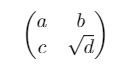

## چه دلایلی برای یادگیری latex وجود دارد؟

برای عده‌ای که در دنیای آکادمیک فعالیت می‌کنند احتمالا یادگیری latex برای نوشتن مقاله برای مجلات یا کنفرانس‌ها
و یا حتی نوشتن پایان‌نامه در قالبی که دانشگاه مشخص کرده است، اجباری ناخوشایند باشد. ولی
ولی در وضعیت فعلی من چنین انگیزه‌هایی ندارم و شاید مهمترین انگیزه‌ی اولیه‌ام کنجکاوی بود ولی
بعد از آشنایی اولیه، ویژگی‌های جذاب دیگری هم دیدم.

اولین دلیل متن باز و رایگان بودن پیاده سازی های موجود است که برای این بستر وجود دارد.
با این حساب اگرچه از شر MS Word تا حدی خلاص می شویم ولی هنوز گزینه های دیگری نظیر Libreoffice
وجود دارد.

دومین ویژگی جذاب برای شروع یادگیری، نسخه زنی است. به عبارتی احتمالا چون بیشتر موارد باینری نیست امکان استفاده از
git برای نگهداری و تغییرات راحت‌تر معادل‌های دیگر نظیر Libreoffice Wirter و MS Word است.

سومین ویژگی مهمی که در نگاه اول به چشم می خورد تنوع کتابخانه ها و تخصصی تر بودن این بستر
در صنعت چاپ است که آشنایی با آن را جذاب می کند.

## ساختار فایل با یک مقاله: سلام به دنیای latex

در این مقاله از ساده ترین ساختار فایل شروع به کار می کنیم.
برای این کار از قالب _article_ استفاده می شود و به مرور از
قابلیت های مختلف آن استفاده می کنیم.
بنظر ساده ترین کد برای شروع با latex ساختاری مشابه کد زیر دارد:

```latex
\documentclass{article}
\begin{document}
  Hello World!
\end{document}
```

در این فایل خط اول تعیین کننده نوع قالب فایل مشخص شده است که در اینجا _article_
است. در خط دوم یک **environment** به نام _document_ شروع شده است که در خط چهارم به پایان
رسیده است. این environment شامل تنها یک خط (Hello World!) است.
به تمامی خطوط قبل از شروع _document_، در اصطلاح **preamble** گفته می شود.

## شیوه ی کامنتگذاری در متن

مثل تمام زبان های برنامه نویسی قابلیت کامنت گذاری دارد که خط کامنت شده در خروجی نمایش داده نمی شود.
هر خطی که با `latex>%` شروع شود، کامنت در نظر گرفته می شود. به عنوان مثال در کد
زیر خط اول در خروجی نشان داده نمی شود:

```latex
%this is a comment
Hello World
```

## افزودن عنوان به مقاله

دومین مرحله اضافه کردن عنوان به مقاله است. برای این کار می توان از کد زیر استفاده کرد:

<details>
<summary>برای مشاهده ی کد کلیک کنید</summary>

```latex
\documentclass{article}

\title{My First Article}
\author{Asaiyan}

\begin{document}
  % this command uses title,author,date to make title of article
  \maketitle
\end{document}
```

</details>

در نگاه اول بنظر می رسد که خطوط 3 و 4 که در preamble آمده است، نوعی متغیر هستند
که احتمالا تابع (دستور یا command گفته می شود) _maketitle_ از آن استفاده می کند. مشخصا این تابع
مقادیر دیگری نظیر تاریخ هم باید داشته باشد چون در خروجی به چشم می خورد.

## افزودن خلاصه به مقاله

برای اضافه کردن یک خلاصه به مقاله باید یک environment با نام _abstract_ به مقاله اضافه شود.
در این صورت با اضافه کردن این بخش کد مرحله ی قبل به صورت زیر تغییر می کند:

<details>
<summary>برای مشاهده ی کد کلیک کنید</summary>

```latex
\documentclass{article}

\title{My First Article}
\author{Asaiyan}

\begin{document}
    \maketitle
\begin{abstract}
    This is a long abstract for my first article. In the next section, I will find
    how to insert lorem ipsum automatically.
\end{abstract}
\end{document}
```

</details>

## افزدون Lorem Ipsum

در حین نوشتن کد بالا متوجه شدم که نیاز به وارد کردن مجموعه پاراگراف های از
پیش آماده واقعا برای یادگیری و تست قابلیت های مختلف این بستر نیاز است.
با گشتن راه حل به صورت کد زیر مشخص شد:

```latex
\documentclass{article}
\usepackage{lipsum}

\begin{document}
\lipsum[1-3]
\end{document}
```

در این کد دو قابلیت جدید وجود دارد:

-   گویا با استفاده از usepackage{package_name} می توان یک package که در اینجا
    lipsum است را استفاده کرد.
-   توابعی مانند lispum که در خط 12 مورد استفاده قرار گرفته می توانند
    یک لیست از ورودی ها را بگیرند. مثلا در اینجا [1-3] به معنی
    پاراگراف های اول تا دوم از متن آماده ی lorem ipsum است.

## بخش بندی مقاله

برخلاف بخش خلاصه که در متن را در یک environment قرار دادیم
در اینجا بنظر از یک دستور استفاده می کنیم. در کد زیر روش اضافه کردن کد را
می بینیم:

```latex
\documentclass{article}
\usepackage{lipsum}

\begin{document}
\section{Introduction}
\lipsum[1-3]
\end{document}
```

تنها تفاوت این کد با کد مرحله ی قبل فقط اضافه شدن خط 12 یا همان
`latex>\section{Introduction}` است. تمام محتوی بعد از آن که در اینجا فراخوانی
تابع lipsum، که سه پاراگراف ساختگی است. در ذیل بخش مقدمه قرار می گیرد.

حال فرض کنیم که مقدمه یک زیربخش داشته باشد. در این حالت بنظر از تابع `latex>\subsection`
استفاده می کنیم که خروجی آن به صورت کد زیر می شود:

```latex
\documentclass{article}
\usepackage{lipsum}

\begin{document}
\section{Introduction}
\lipsum[1]
\subsection{Dummy}
\lipsum[2-3]
\end{document}
```

در این بخش تابع lispum رو به دو بخش تقسیم کرده و پاراگراف های دوم و سوم را در یک
زیربخش مجزا با عنوان Dummy قرار دادم.

## اضافه کردن تصویر به مقاله

برای اضافه کردن عکس می توان از کتابخانه _graphicx_ استفاده کرد.
با استفاده از دستور `latex>\includegraphics[options]{path}` در این کتابخانه
می توان یک عکس را که در اینجا با فرمت _png_ بود به مقاله
اضافه کرد. کد زیر تصویر _TheGnuLogo.png_ را به مقاله
را نشان می دهد:

```latex
\documentclass{article}
\usepackage{graphicx}

\begin{document}
This is a dummy sentence.
\includegraphics{TheGnuLogo.png}
\end{document}
```

مشکلی که در زمان اضافه کردن عکس به وجود آمد این بود که ابعاد عکس از اندازه های صفحه بزرگ تر بود. برای همین دو _هشدار_ زیر داده شد:

-   Overfull \vbox (52.24852pt too high)
-   Overfull \hbox (365.59741pt too wide)

برای رفع این مشکل مشخص شد که می توان علاوه بر نام فایل مجموعه ای از تنظیمات را به
دستور _includegraphics_ داد. به عنوان مثال در کد زیر دیگر هشدار کد بالا مشاهده نشد:

```latex
\documentclass{article}
\usepackage{graphicx}

\begin{document}
This is a dummy sentence.
\includegraphics[scale=0.1]{TheGnuLogo.png}
\end{document}
```

در این کد با استفاده از عبارت `latex>[scale=0.1]` اندازه ی تصویر داده شده به یک دهم اندازه ی
واقعی آن تغییر کرد.
البته روش های دیگری برای حل چنین مشکلی وجود دارد. استفاده از _scale_ به دلیل اینکه معمولا
نمی دانیم ابعاد تصویر چقدر است، می تواند ایجاد دردسر کند.

یک راه دیگر برای رفع این مسئله استفاده از دیگر تنظیمات مانند `latex>[width=7cm]` است.
مشکل این روش هم در نظر گرفتن پیش فرض عرض صفحه است. راه کار دیگر استفاده از دستور `latex>[width=0.5\textwidth]` است. در این تنظیم
با استفاده از دستور `latex>\textwidth` اندازه ی تصویر به اندازه ی نصف طول ستون متنی تنظیم
می شود. لازم به ذکر است که استفاده از تنظیم _width_ مانع از بروز هشدار مربوط به عبور از اندازه ی
طول صفحه نمی شود ولی برای آن هم می توان به صورت مشابه عمل کرد.

### تنظیمات تصویر درج شده

فرض کنیم برای تصویر لوگوی بالا بخواهیم موارد زیر را هم در نظر
بگیریم:

-   در ابتدای صفحه و قبل از متن باشد
-   دارای یک caption باشد
-   نصف طول ستون متنی باشد
-   وسط صفحه باشد

برای رسید به چنین نیازمندی هایی می شود به صورت قطعه کد زیر عمل کرد:

```latex
\begin{figure}[t]
    \centering
    \includegraphics[width=0.5\textwidth]{TheGnuLogo.png}
    \caption{GNU Log}
\end{figure}
```

همانطور که این کد مشخص است، ابتدا یک env با نام figure تعریف می شود.
سپس به این env با تنظیم `latex>[t]` می گوییم که در بالای صفحه (top) باشد.
در صورتی که نیاز بود تصویر به انتهای صفحه منتقل شود کافی بود به جای _t_ از _b_
استفاده می شد. در صورتی هم که هیچ یک از این دو تنظیم مشخص نشود، کامپایلر
بر اساس شرایط جای تصویر را مشخص می کند.

پس از آن هم با استفاده از دستورات `latex>\centering` و `latex>\caption` تصویر
را در وسط صفحه قرار می دهیم و برای آن _caption_ تعیین می کنیم.

## رفتن به خط جدید یا صفحه ای جدید

با وجود رفع مشکل مربوط به اندازه ی تصویر، خروجی نهایی جالب به نظر نمی رسد. تصویر به پاراگراف قبلی چسبیده است.
برای رفع این مسئله هم می توان با دستور `latex>\newline` قبل از افزودن تصویر، آن را به خط بعد منتقل کرد.
برای رفتن به خط بعد حداقل دو روش دیگر وجود دارد: یکی استفاده از `latex>\\` و دوم قرار دادن یک خط خالی میان دو سطر.
همچنین می توان با استفاده از دستور `latex>\newpage` آن را به ابتدای صفحه ای جدید منتقل کرد
در کد زیر هر دو دستور استفاده شده است:

<details>
<summary>برای مشاهده ی کد کلیک کنید</summary>

```latex
\documentclass{article}
\usepackage{lipsum}
\usepackage{graphicx}
\title{My First Article}
\author{Asaiyan}

\begin{document}
    \maketitle
\begin{abstract}
    This is a long abstract for my first article. In the next section, I will find
    how to insert lorem ipsum automatically.
\end{abstract}
\section{Introduction}
\lipsum[1]
\newpage % <---- Add new page
\subsection{Dummy}
\lipsum[2-3]
\newline % <----- Add new line
\includegraphics[scale=0.1]{TheGnuLogo.png}
\end{document}
```

</details>

## جدول

برای ساخت جدول باید حداقل یک env با نام tablular ساخت.
به عنوان نمونه کد زیر نمونه ای از ساخت یک جدول 3x2 بعدی است:

```latex
\begin{tabular}{|c|lp{1in}|}    \hline
    head1 & head2 & head3    \\ \hline
    data1 & data2 & data3    \\ \hline
\end{tabular}
```

خط اول قطعه کد بالا شامل سه بخش می شود:

-   `latex>\begin{tablular}`: تعریف یک env برای جدول
-   `latex>{|c|lp{1in}|}`: تعریف ویژگی های ستون ها. در این بخش هر حرف نشان دهنده ی ویژگی یک ستون است.
    به عنوان مثال کاراکتر `c` معادل center یا وسط چین بودن عناصر ستون اول است.
    کاراکتر `l` نشان دهنده ی چپ چین بودن ستون میانی است و کاراکتر `p` نشان دهنده ی
    ستون سومی است که عرض ستون آن 1in است. از طرفی قرار گیری کاراکتر `|` نشان دهنده ی
    شکل ظاهری ستون ها است. در این شکل صورت در این مثال تمام دیوارهای اطراف ستون ها بجز دیوار
    میان ستون دوم و سوم نشان داده خواهد شد.
-   `latex>\hline`: تعیین فرم خط افقی بالایی جدول. البته اگر این دستور در هر سطری قرار بگیرید، یک خط افقی پایین سطر قرار می گیرد.

هر سطر داده نیز دارای ویژگی های زیر است:

-   داده های ستون های مختلف یا کاراکتر `&` از هم جدا می شوند.
-   در انتهای هر سطر داده باید به یکی از روش هایی که در بالا گفته شد، رفتن به سطر بعد را اعلام کنیم. در اینجا
    از قابلیت `latex>\\` استفاده شده است.
-   اگر نیاز به قراردادن خط افقی پایین سطر وجود داشت، بعد در انتها از دستور `latex>\hline` استفاده می شود.

اگر قرار باشد که یک جدول به صورت در بالا یا پایین صفحه به صورت شناور قرار گیرد،
باید tabular در یک env دیگر با نام table قرار گیرد. به عنوان مثال کد زیر به صورت
یک جدول شناور در پایین صفحه و وسط عرض صفحه با عنوان _First Table_ قرار می گیرد.

```latex
\begin{table}[b]
    \centering
    \begin{tabular}{|c|lp{1in}|}    \hline
        head1 & head2 & head3    \\ \hline
        cell-1 & cell-2 & cell-3 \\
        cell-4 & cell-5 & cell-6 \\ \hline
    \end{tabular}
    \caption{First table}
\end{table}
```

نتیجه ی مورد انتظار قطعه کد بالا در یک مقاله شبیه تصویر زیر است.


## وارد کردن محتوی یک فایل دیگر

## لیست اقلام

به طور معمول لیست هایی که قرار است نمایش داده شود یا ترتیب و تعداد
در آنها اهمیت دارد که در این صورت اقلام شماره گذاری می شوند و
یا اهمیت ندارد که در این صورت به صورت بولت وار نمایش داده می شوند.
برای هر کدام از این دو env مخصوصی تعریف شده است ولی در هر دو لیست
ساختار معرفی لیست اقلام یکی است.

برای هر دو لیست امکان تعریف لیست های تودرتو وجود دارد.

### لیست اقلام شمارشی

برای تعریف لیست شمارشی itemها را در یک env با نام `enumerate` قرار
می دهیم. (همانند کد زیر)

```latex
\begin{enumerate}
	\item First item
	\item Second item
        \begin{enumerate}
            \item First nested item
            \item Second nested item
        \end{enumerate}
\end{enumerate}
```

نتیجه ی مورد انتظار قطعه کد بالا در یک مقاله شبیه تصویر زیر است.


### لیست اقلام بدون ترتیب

برای تعریف لیست شمارشی itemها را در یک env با نام `itemize` قرار
می دهیم. (همانند کد زیر)

```latex
\begin{itemize}
    \item First item
    \item Second item
        \begin{itemize}
            \item First nested item
            \item Second nested item
        \end{itemize}
\end{itemize}
```

نتیجه ی مورد انتظار قطعه کد بالا در یک مقاله شبیه تصویر زیر است.


## انواع تاکید

برای نمایش تاکید در بخشی از جمله می توان از دستور `latex>\emph{some important words}` استفاده
کرد. در کلاس _article_ شکل ظاهری جمله ی تاکید شده به صورت _italic_ نمایش داده می شود.

## نمایش دستورات در متن

اگر قرار باشد که بخشی از دستورات در متن نمایش داده شود می توان به صورت `latex>\verb|\newline|` از دستور
`latex>\verb` استفاده کرد. به عنوان مثال در این مثال دستور `latex>\newline` به صورت متنی
و با فونت متفاوت در متن نمایش داده می شود.

## ارجاع و برچسب درون متن

هر جا در متن که نیاز باشد می توان با استفاده از دستور `latex>\label{name}` یک
برچسب زد و در صورت نیاز به ارجاع با استفاده از دستور `latex>\cite{name}` به آن
ارجاع داد. لازم به ذکر است که برای اینکه ارجاع از کلمه ی قبلی آن جدا نشود بهتر
است همیشه به صورت `latex>~\cite{name}` استفاده شود.

## ارجاع به مقالات و منابع بیرونی

برای ارجاع به مراجع بیرونی هم می توان از دستور `latex>\cite{name}` استفاده کرد.
مهمترین تفاوت در درج اطلاعات است که برای آن می توان یک فایل مجزا با پسوند `.bib`
ساخت و با استفاده از دستور `latex>\bibliography{bibfile}` به مقاله اضافه کرد.
در زیر ابتدا محتوای فایل `bibfile.bib` و سپس شیوه ی استفاده از آن در مقاله
را مشاهده می کنید.

```latex
@incollection{einstein1922general,
    title={The general theory of relativity},
    author={Einstein, Albert},
    booktitle={The Meaning of Relativity},
    pages={54--75},
    year={1922},
    publisher={Springer}
}
```

```latex
\documentclass{article}
\begin{document}

This line could reference.~\cite{einstein1922general}

\bibliographystyle{plain}
\bibliography{bibfile}

\end{document}
```

نتیجه ی مورد انتظار کد بالا شبیه تصویر زیر است.


## فرمول های ریاضی

یکی از مستنداتی که می توان برای یادگیری نوشتن فرمول های ریاضی در
[Short Math Guide for Latex](http://tug.ctan.org/info/short-math-guide/short-math-guide.pdf) است.

### inline mode

اگر قرار باشد یک فرمول در میان یک جمله نمایش داده شود، می توان به صورت کد زیر عمل کرد:

```latex
This line contains $ E = mc^2 $

If we need to use \$ we can escape it \verb|\$|
```

نتیجه ی مورد انتظار قطعه کد بالا در یک مقاله به صورت تصویر زیر خواهد بود:


### display mode

اگر فرمول طولانی تر از این باشد که در متن قرار گیرد و یا نیاز به مجزا کردن
آن از متن وجود داشته باشد، می توان به دو روش مانند کد زیر عمل کرد:

```latex
\begin{equation}
  \sum_{i=1}^{\infty}{\frac{1}{i}}
\end{equation}

\[ \int_0^n{x^2} \]
```

در روش اول به ازای هر env یک شماره در کنار آن قرار می گیرد ولی در مورد روش
دوم چنین شماره گذاری انجام نمی شود. روش دوم امکان استفاده به صورت چند خطی
را نیز دارد. نتیجه ی مورد انتظار قطعه کد بالا در یک مقاله به صورت
تصویر زیر خواهد بود.


### یک ماتریس

برای اضافه کردن یک ماتریس می توان با استفاده از کتابخانه ی _amsmath_ شبیه کد زیر عمل کرد:

```latex
\documentclass{article}
\usepackage{amsmath}

\begin{document}

\[
\begin{pmatrix}
a & b        \\
c & \sqrt{d}
\end{pmatrix}
\]

\end{document}
```

نتیجه ی مورد انتظار کد بالا شبیه تصویر زیر است.


## استفاده از نشان ها

برای استفاده از سمبل ها در فرمول ها و یا هر جای دیگری در متن می توان
از دستور مختلص آن سمبل استفاده کرد. به عنوان مثال در کد زیر از چهار سمبل
مختلف در یک فرمول استفاده شده است.

```latex
\[ \alpha * \beta \times \gamma \div \Gamma \]
```

برای دسترسی به لیست جامعی از سمبل ها می توان به
[The Comprehensive LaTeX Symbol List](http://tug.ctan.org/info/symbols/comprehensive/symbols-a4.pdf)
رجوع کرد.

همچنین اگر سمبلی هست که نیاز به استفاده ی آن باشد ولی دستور و کتابخانه ی آن را ندانیم
می توان از سایت [تبدیل دست خط به سمبل های موجود در کتابخانه های مختلف - DeTexify](https://detexify.kirelabs.org/classify.html)
استفاده کرد.

## ساخت یک دستور جدید

اگر دستور یا فرمولی باشد که زیاد تکرار می شود می توان آن را به عنوان یک دستور جدید
اضافه کنیم و در جاهای مختلف استفاده کنیم. به عنوان مثال در کد زیر یک فرمول در جاهای مختلف
قابل تکرار است.

```latex
\documentclass{article}

\newcommand{\emctwo}{$E=mc^s$}

\begin{document}
\emctwo
\end{document}
```

## نوشتن الگوریتم

برای نوشتن الگوریتم می توان از کتابخانه ی _algorithm_ به صورت کد زیر استفاده کرد:

```latex
\documentclass{article}
\usepackage{algorithm}
\usepackage{algorithmic}
\begin{document}

\begin{algorithm}
\begin{algorithmic}[1]
\REQUIRE{Nothing}
\ENSURE{Return number of evens }
    \STATE $i\gets 0$
    \FOR{$j=0$ \TO $10$}
        \IF{$i \div 2 \equiv 0$}
            \STATE $i++$
        \ELSE
            \STATE nop()
        \ENDIF
    \ENDFOR
\RETURN i
\end{algorithmic}
\caption{Count even numbers}
\end{algorithm}

\end{document}
```

نتیجه ی مورد انتظار کد بالا شبیه عکس زیر خواهد بود.


## listings

برای اضافه کردن یک کد می توان با استفاده از کتابخانه ی _listings_ مشابه کد زیر عمل کرد:

```latex
\documentclass{article}
\usepackage{listings}
\begin{document}

\lstset{language=c++}
\lstset{caption=Simple C++ loop}
\begin{lstlisting}[frame=single]{}
int j = 0;
for(i = 0; i < 10; i++){
    // increment the pointer
    j+=i;
}
\end{lstlisting}

\end{document}
```

خروجی مورد انتظار کد بالا به صورت تصویر زیر خواهد بود:


علاوه بر این می توان یک فایل کد (hello-world.cpp) را هم به صورت کد زیر در مقاله وارد کرد.

```latex
\documentclass{article}
\usepackage{listings}
\begin{document}

\lstset{language=c++,frame=single,numbers=left}
\lstinputlisting[caption=Signing]{hello-world.cpp}

\end{document}
```

## لینک های مفید

[کاتالوگ فونت ها](https://tug.org/FontCatalogue/)

[The Not So Short Introduction to LaTex2e](https://tobi.oetiker.ch/lshort/lshort.pdf)

[The Not So Short Introduction to LaTex2e(source)](https://github.com/oetiker/lshort)
