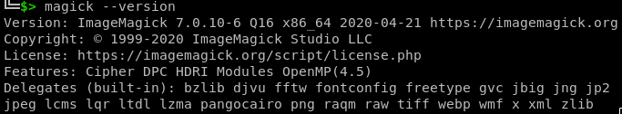
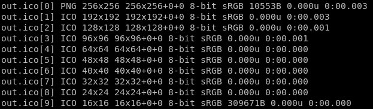

برای برخی کارهای ساده‌ی گرافیکی معادل‌های دستوری ساده‌ای وجود دارد که استفاده از آنها باعث صرفه‌جویی در زمان و در بعضی موارد افزایش کیفیت خواهد شد. تنها مشکل این روش‌های ساده سرعت ما در فراموش کردن آنهاست و معمولا مهمترین راهکار ما یادداشت‌برداری این دستورات است. به احتمال زیاد این پست مانند یک دفترچه‌ی یادداشت یا Cheatsheet برای حفظ تجربیاتم در این گونه دستوراتی که استفاده می‌کنم خواهد شد و به مرور تکمیل تر خواهد شد.

## ابزارهای مورد استفاده

در این بخش به مرور برخی از ابزارهای مورد استفاده و راهکارهای نصب آنها خواهم پرداخت.

### ImageMagick: کار با تصاویر در خط فرمان

برای تبدیل فایل‌های عکس من بیشتر از ابزار [ImageMagick](https://www.imagemagick.org/) استفاده می کنم. نسخه‌ی ۶ این ابزار در مخازن Debian و Ubuntu وجود دارد و من ترجیح می‌دهم از این ابراز را از روی مخزن بسازم و نصب کنم. برای این کار از دستورات زیر استفاده می‌کنم:

```bash
sudo apt install libltdl-dev libtiff-dev \
    libwmf-dev libjpeg-dev libjpeg62-turbo-dev \
    libzstd-dev libwebp-dev librsvg2-dev \
    libraw-dev libraqm-dev libpango1.0-dev \
    libopenjp2-7-dev liblqr-1-0-dev libgraphviz-dev \
    libfftw3-dev libdjvulibre-dev libgsl-dev \
    librsvg2-dev librsvg2-common librsvg2-bin \
    fonts-dejavu-core fonts-droid-fallback \
    fonts-noto-mono ghostscript gsfonts \
    hicolor-icon-theme libxt6-dbg fonts-urw-base35 \
    ghostscript-x fontconfig fontconfig-config libperl-dev
git clone https://github.com/ImageMagick/ImageMagick.git
cd ImageMagick/
git checkout 7.0.10-6
./configure --with-modules --enable-shared --with-perl
make -j`nproc`
sudo make install
sudo ldconfig /usr/local/lib
```

در صورتی که مراحل بالا بدون هیچ خطایی انجام شود، خروجی دستور `bash>magick --version` مانند تصویر زیر خواهد بود:



## تبدبل فرمت‌های مختلف عکس به فرمت ico

فرمت ico که بیشترین کاربرد آن به عنوان آیکون برنامه‌ها و favicon در سایت‌ها است. این فرمت نوعی فرمت نگهدارنده (Container) به حساب می‌آید. به عبارتی همانند دیگر فرمت‌های نگهدارنده امکان در کنار هم قرار دادن محتوی‌های مختلف را فراهم می آورد. برای تبدیل تصاویر با فرمت‌های دیگر مثل PNG می‌توان از دستور زیر بهره برد:

```bash
convert in.png -define icon:auto-resize out.ico
```

در صورتی که این دستور بدون خطا به اتمام برسد برای بررسی وضعیت نتیجه‌ی خروجی می‌توان از دستور زیر بهره برد که در آن نتیجه‌ی زیر مورد انتظار خواهد بود:

```bash
identify out.ico
```



همان طور که در نتیجه‌ی خروجی شاهد هستیم، بعد از تبدیل کردن فایل PNG ورودی به فرمت ICO، نمونه‌های مختلف تصویر در ابعاد مختلف در فایل قرار گرفته است که هر کدام از این تصاویر ابعاد متفاوتی نسبت به دیگران دارد.
